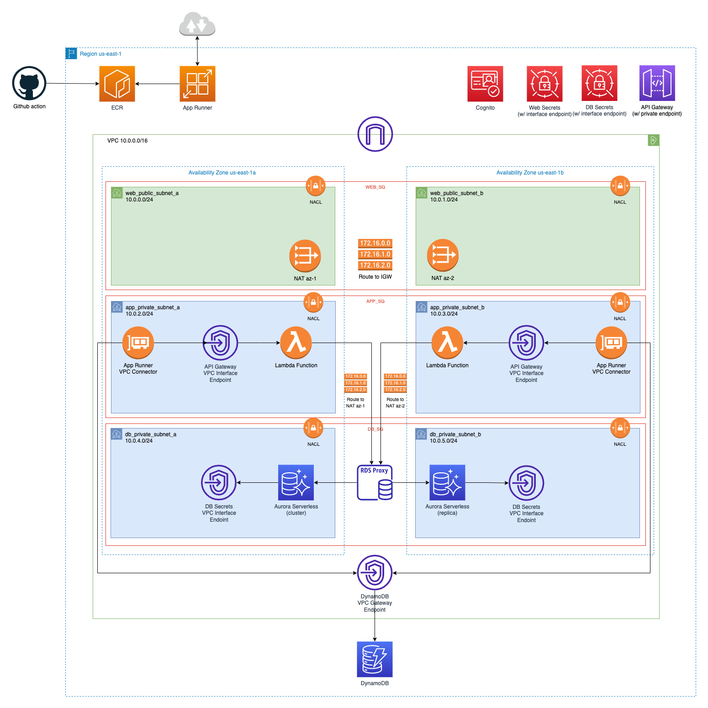

# Build a 100% Serverless 3-Tier Architecture Using CloudFormation

This solution builds a serverless 3-tier, highly available architecture for hosting a public web app with a private API app. It assumes your application code is containerized and pushed to Amazon ECR. The solutions is configured to re-deploy your code automatically.

The solution provisions a VPC with 2 public subnets, 4 private subnets and 2 NAT Gateways. For the database tier it provisions an RDS Proxy in front of PostgreSQL Aurora Serverless V2 cluster. A DynamoDB table is provisioned for session storage. Database secrets are stored in Secrets Manager. VPC Endpoints are used where possible.

For the application (API) tier it provisions a private API Gateway in front of a Lambda function which in turn queries the datatabase via the proxy. A Cognito userpool is provisioned which is connected to API gatway as an authorizer.

Finally, for the web tier an App Runner instance is provisioned to host the web facing app. It is connected to the VPC so it can access the API Gateway. Web secrets are stored in Secrets Manager. A Synthetic Canary checks if the app is available.

## CI/CD automation and scale

This solution is built to be deployed as part of a CI/CD pipeline using GitHub workflows. It supports multiple application environments and AWS accounts. For example, you can provision separate staging and production environments in seperate AWS accounts automatically. To get started: fork the repository, follow the prerequisites and push your code to GitHub.

## Whitepaper and use case

For a technical deep dive and more detailed step by step please refer to the available [whitepaper](https://www.skripted.io/whitepaper-serverless-3-tier-cloudformation). A Shopify app an private API built in Node.js were used a use cases for this solution. Hence you'll find references to that.

## Prerequisites

The solution uses federated, keyless access to AWS so were are not storing AWS access keys in GitHUb. Follow these steps to set this up:

- Create a fresh AWS account (optional)
- In IAM using the console, set up AWS keyless federation:
  - Go to IAM console
  - Click "Identiy providers"
  - Click "Add provider"
  - Select "OpendID Connect" with provider URL: https://token.actions.githubusercontent.com
  - Click “Get thumbprint”
  - For "Audience" type: “sts.amazonaws.com” and click "Add provider"
  - Done
- Create an IAM role for GitHub
  - In IAM, in the “Identity Providers” overview click "token.actions.githubusercontent.com"
  - Copy the generated arn, ie: "arn:aws:iam::01234567890:oidc-provider/token.actions.githubusercontent.com"
  - Paste the arn into the "iam_role_for_github.yml" script of this repository.
  - Update the parameter called “GitHubOrg” to match your repository name
  - Manually deploy iam_role_for_github.yml in CloudFormation using the console.

For more information on setting up keyless github access visit [this](https://docs.cloudquery.io/blog/keyless-access-to-aws-in-github-actions-with-oidc) link.
For more information on setting up OpenID in AWS visit [this](https://docs.github.com/en/actions/deployment/security-hardening-your-deployments/configuring-openid-connect-in-amazon-web-services) link.

## Deployment steps

1. The previous script (the one that creates the IAM role) outputs the role arn. Copy this arn.
2. Paste the arn into ./github/workflows/deploy\_`<BRANCH>`\_to_aws.yml
3. Push your code to GitHub.

Assuming you are working in the “staging” branch, and your GitHub workflow is active in ./github/workflows, once you push your code the workflow will automatically run. Repeat these steps each branch and AWS account you need to set up.

## Structure

```console
├── iam_role_for_github.yml
├── 0-vpc
│   └── vpc.yml
│   └── vpc_flow_log.yml
│   └── ecr_repositories
├── 1-db-tier
│   └── db_secrets.yml
│   └── db_rds_proxy.yml
│   └── db_aurora_cluster.yml
│   └── db_dynamodb_table.yml
├── 2-app-tier
│   └── app_lambda_api.yml
│   └── app_api_gateway.yml
│   └── app_cognito_userpool.yml
├── 3-web-tier
│   └── web_secrets.yml
│   └── web_app_runner_service.yml
│   └── web_app_runner_canary.yml
```

## Stack details

1. `iam_role_for_github.yml` creates an IAM role for GitHub including the necessary permissions.
2. `/0-vpc/vpc.yml` configures the VPC, subnets, NATs, security groups, etc.
3. `/0-vpc/vpc_flow_log.yml` configures a VPC Flow Log to monitor traffic
4. `/0-vpc/ecr_reposities.yml` configures ECR repositories needed to host your apps
5. `/1-db-tier/db_secrets.yml` configures a Secrets Manager instance to host database secrets
6. `/1-db-tier/db_rds_proxy.yml` configures an RDS proxy service
7. `/1-db-tier/db_auora_cluster.yml` configures a serverless Aurora cluster
8. `/1-db-tier/db_dynamodb_table.yml` configures a DynamoDB table for session storage
9. `/2-app-tier/app_lambda_api.yml` configures a Lambda function for code hosted in ECR
10. `/2-app-tier/app_api_gateway.yml` configures a private API Gateway with Lambda as proxy
11. `/2-app-tier/app_cognito_userpool.yml` configures a Cognito userpool for App Runner to authenticate with API Gateway
12. `/3-app-tier/web_secrets.yml` configures a Secrets Manager instance to host web secrets
13. `/3-app-tier/web_app_runner_service.yml` configures an App Runner service to host a web app
14. `/3-app-tier/web_app_runner_canary.yml` configures a Synthethic Canary to monitor availability of a web app

## Target architecture



## Troubleshooting

Please note that on initial creation the script will fail at the provisioning of the Lambda function. This is because you will first need to push the container image for your Lambda function to ECR. Once you’ve done that, simply run the script again and it will continue where it left off.

The same goes for App Runner with the additional requirement of adding the necessary API and SDK keys into your Secrets Manager manually after it has been provisioned.

Email me of you need help.

## Author

- Maxim Schram [max@skripted.io](mailto:max@skripted.io)
